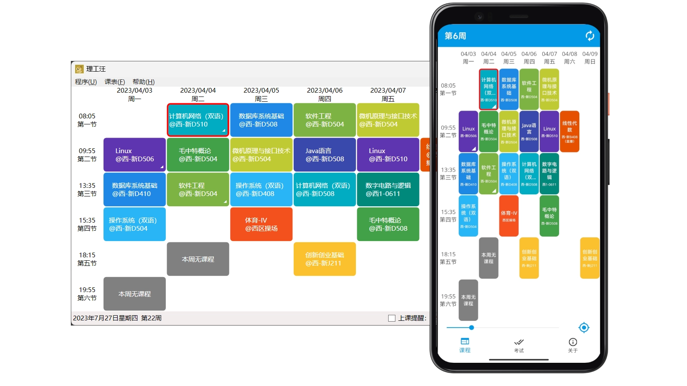

# 理工汪
开源的教务在线接口/课程表查看工具（哈尔滨理工大学）

## 开发动机
> 校园网好烂  
赶着上课查不到教室好烦  
小程序还要登录好麻烦  
要是点开就能查课表就好了

## 功能特色
* 课表展示
* 考试查询
* 本地缓存
* 上课提醒（仅 Windows 端）

## 技术特色
* MVVM 架构，界面逻辑分离
* 在 WPF 桌面开发中应用依赖注入
* XAML 自定义控件，单一化职责
* 使用 .NET MAUI 前沿跨平台框架
* 入门学习项目，不编了……

## 界面展示

## 项目说明
* `Hrbust`：封装的哈尔滨理工大学教务在线 API 库，接口均为模拟网页请求得到，使用 `HtmlAgilityPack` 包来完成 HTML 解析操作。
* `HrbustDoggy.Cli`：一个简单的命令行客户端，用来测试上述 API 库的功能，也可满足简单使用。由于验证码的显示用到了 WinForm，只能于 Windows 上运行。
* `HrbustDoggy.Maui`：使用 .NET MAUI 框架开发的跨平台客户端。
* `HrbustDoggy.Wpf`：使用 WPF 框架开发的 Windows 桌面客户端。

## 构建说明
* 生成此项目前，请确保安装 .NET 8.0（或更新版本）SDK。  
执行 `dotnet workload restore` 以安装解决方案所需的工作负载。
* 项目开发环境为 Visual Studio 2022 17.8.2。
Visual Studio Code 配合相关插件应该也能胜任开发工作。  
* 删除了 HrbustDoggy.Maui 项目中的 MacOS 和 iOS 平台目标。理论上该项目也能生成 MacOS 和 iOS 相应可执行文件，有条件可自行测试。

## 其他
入门级项目，技术含量不高，不过在代码组织、用户体验和其他细节方面都花了不少时间。有需要的同学可作为参考项目学习。  
